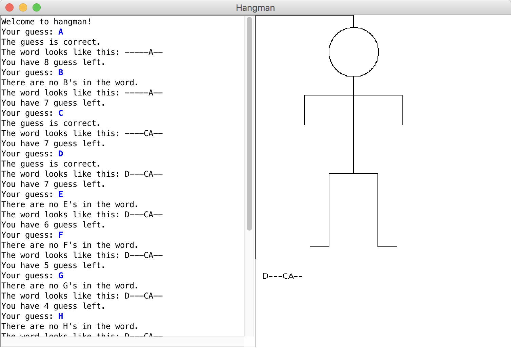

# hangman
Hangman game implementation based on [stanford instruction](https://web.stanford.edu/class/archive/cs/cs107a/cs106a.1124/handouts/200%20Assignment%204.pdf).
There is much more discuss about hangman game at [stack exchange](https://codegolf.stackexchange.com/questions/25496/write-a-hangman-solver)

This implememtation based on [acm library](http://cs.stanford.edu/people/eroberts/jtf/javadoc/student/overview-summary.html).

## Screenshot

## how to run

1. compile:`javac -classpath .:acm.jar Hangman.java`
2. run:`java -classpath .:acm.jar Hangman`
